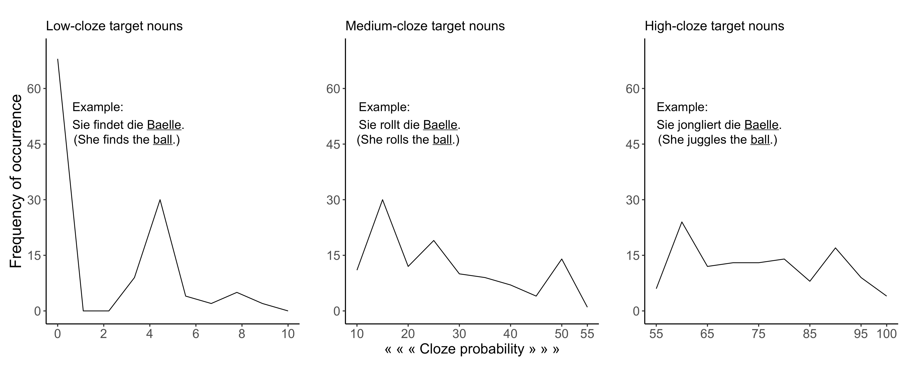

---
#########################################
# options for knitting a single chapter #
#########################################
output:
  bookdown::pdf_document2:
    template: templates/brief_template.tex
    citation_package: biblatex
  bookdown::html_document2: default
  bookdown::word_document2: default
documentclass: book
bibliography: [bibliography/references.bib, bibliography/additional-references.bib]
---

# General methods {#chapter-methods}
\chaptermark{Methods}

In this chapter we provide an overview of the experimental materials that are used in the experiments described in Chapters 5, 6, and 7.
Sentences used as experimental material were common to all the experiments,
and the signal processing method was also common.
Here, we also present an overview of online data collection.

## Experimental materials {#experimental-materials}

As a part of a study in the research project A4 of SFB1102, sentences of different levels of predictability were created.
Digital recordings of the sentences were degraded by noise vocoding and used in all experiments reported in this thesis.
Speech was also distorted by its compression and expansion.
<!-- In all the experiments in this thesis, we used spoken sentences which were degraded by noise vocoding. -->
<!-- We processed those spoken sentences to create different versions of distorted speech. -->
Below we briefly describe how the sentences of different levels of predictability were obtained,
and what methodology was used to create distorted versions of the speech.

### Stimulus sentences

With an aim to create sentences of three levels of predictability (low, medium, and high), a triplet of 120 sentences --- total of 360 sentences --- were created from 120 nouns.
Out of 120 nouns, 6 were repeated.
All sentences were in present tense consisting of pronoun, verb, determiner, and object.
These sentences were in Subject-Verb-Object form (e.g., *Er fängt den Ball*. EN: He catches the ball.).
Some of these sentences were taken from @Obleser2010.
For each sentence, cloze probability ratings were collected from a group of young adults (n = 60; age range = 18 – 30 years).
Mean cloze probabilities were 0.022 (SD = 0.027; range = 0.00 – 0.09) for low-predictability sentences,
0.274 (SD = 0.134; range = 0.1 – 0.55) for medium-predictability sentences,
and 0.752 (SD = 0.123; range = 0.56 – 1.00) for high-predictability sentences.
The distribution of cloze probability across low-, medium-, and high-predictability sentences is shown in Figure \@ref(fig:cloze-distribution),
and the cloze probability for individual sentence is shown in Appendix A.

```{r cloze-distribution, eval=TRUE, echo=FALSE, fig.align='center', fig.cap="Distribution of cloze probability ratings of target words in low, medium and high predictability sentences", out.width="90%"}

```


### Speech processing {#speech-processing}

All 360 sentence were spoken by a female native speaker of German at a normal rate.
The recordings were digitized at 44.1kHz with 32-bit linear encoding.
Spoken sentences used in Chapter 5, 6, 7, and 8 were degraded by noise vocoding.
In addition to degradation by noise vocoding, the sentences were distorted by compression and expansion of speech signal in Chapter 7.

#### Noise-vocoding {#noise-vocoding}

<!-- If the cut-off frequencies of the bandwidth of the speech signal (i.e., the analysis band) and the bandwidth of the noise do not match then the resulting noise-vocoded speech becomes spectrally shifted [e.g., @Faulkner2012]. -->
Noise vocoding is used to parametrically vary and control the quality of speech signal in a graded manner.
<!-- It largely removes the spectral details of the speech signal but preserves the temporal and preiodicity cues [@Rosen1999]. -->
It distorts a speech signal by dividing it into specific frequency bands corresponding to the number of vocoder channels.
The frequency bands are analogous to the electrodes of cochlear implant [@Shannon1995; @Loizou1999; @Shannon2004].
The amplitude envelope, i.e., the fluctuations of amplitude, within each frequency band is extracted and the spectral information within it is replaced by noise.
This makes the vocoded speech difficult to understand although temporal characteristics and periodicity of perceptual cues are preserved [@Rosen1999].

The spectral degradation conditions of 1, 4, 6, and 8 channels were achieved for each of the 360 recorded sentences using a customized script originally written by @Darwin2005 in Praat software.
The speech signal was divided into 1, 4, 6, and 8 frequency bands between 70 and 9,000Hz.
The boundary frequencies were approximately logarithmically spaced following cochlear-frequency position functions [@Erb2014; @Greenwood1990; @Rosen1999].
The amplitude envelope of each band was extracted and applied to band-pass filtered white noise in the same frequency ranges;
the upper and lower bounds for band extraction are specified in Table \@ref(frequencies).
Each of the modulated noise was then combined to produce degraded speech.
Scaling was performed to equate the root-mean-square value of the original undistorted speech and the final degraded speech.
This resulted into four levels of degradation: 1, 4, 6, and 8 channels noise vocoded speech.
<!-- The 1-channel noise-vocoding provides a baseline condition as speech encoded with only one frequency band is least to non-intelligible. -->
<!--However, speech vocoded through four or more channels has been shown to be well intelligible – Ueda and Nakajima (2017) derived from the factor analysis of spectral fluctuations in eight languages, including German, that four channels are sufficient, and they also identified the optimal boundary frequencies for 4 channels vocoding.
These are similar, although not identical, to the cochlear-frequency position function-based boundary frequencies chosen in the current study.-->

Spectrograms of clear speech and noise-vocoded speech for the sentence *Er löest die Aufgabe* are shown in Figure \@ref(fig:vocoding-spectrogram). It shows that with a decrease in the number of noise vocoding channels, the information in speech signal reduces and becomes noise-like.

```{r vocoding-spectrogram, eval=TRUE, echo=FALSE, fig.show='hold', fig.pos="!htpb", fig.sep='\\par', fig.align='center', fig.cap="Spectrograms of clear speech, and degraded speech arranged with a decreasing number of noise vocoding channels (8, 6, 4 and 1 band) for the sentence `Er löest die Aufgabe.' ", out.width="90%"}

knitr::include_graphics("figures/materials/aufgabe_clear.png")

knitr::include_graphics(rep(c("figures/materials/aufgabe_8bands.png",
                              "figures/materials/aufgabe_6bands.png"),1))

knitr::include_graphics(rep(c("figures/materials/aufgabe_4bands.png",
                              "figures/materials/aufgabe_1band.png"),1))

```

```{=tex}
\begin{table}[H]
\begin{center} 
\caption{Boundary frequencies (in Hz) for 1, 4, 6 and 8 channels noise-vocoding conditions} 
\label{frequencies} 
\vskip 0.12in
\begin{tabular}{llllllllll} 
\hline
Number of channels     &    Boundary frequencies \\
\hline
1   &   70    &   9000   &     &     &       &       &        &       &   \\

4   &   70    &   423   &   1304  &   3504  &   9000    &       &        &       &   \\

6   &   70    &   268   &   633   &   1304  &   2539    &   4813    &    9000    &       &   \\

8   &   70    &   207   &   423   &   764   &   1304    &   2156    &    3504    &   5634    &   9000\\
\hline
\end{tabular} 
\end{center} 
\end{table}
```

#### Speech compression and expansion {#compression-expansion}

As early as the mid-twentieth century, investigators have reported that intelligibility does not drop significantly when speech is speeded up to 2 times the normal speech rate [e.g., @Garvey1953].
Speech rate was increased by chopping physical tapes.
Digital algorithms like pitch-synchronous overlap-add technique [PSOLA, @Charpentier1986; @Moulines1990] developed in the 1980s and later [overlap-add technique based on waveform similarity, @Verhelst1993] now allow us to speed up and slow down the speech rate in a controlled fashion.

In Chapter 7, we used Praat software that utilizes uniform time-compression algorithm (PSOLA) to create slow and fast speech with the compression factor of 1.35 and 0.65 respectively.
PSOLA analyzes the pitch of an auditory signal in the time domain of its digital waveform to set pitch marks, and then segments the signal into successive analysis windows centered around those pitch marks.
To create synthesized speech (i.e., fast or slow speech), a new set of pitch marks are calculated, and the analysis windows are rearranged.
Depending on the time-compression factor, some analysis windows are deleted, and the remaining windows are concatenated by superimposing and averaging the neighboring analysis windows.
<!-- Hence the resulting speech signal is compressed, i.e., it is perceived to be faster than the original speech [e.g., CITE ] -->
The distortion of phonemic properties of speech signals are minimal when accelerating and slowing down within the range of factor 2 or below [@Moulines1990].

In Chapter 7, we created fast and slow versions of 120 high-predictability sentences and 120 low-predictability sentences, but did not use medium-predictability sentences.
These 480 recordings were then passed through 4 channels noise vocoding to use as experimental materials.
<!-- Spectrograms of clear speech, fast speech, slow speech, and noise vocoded fast and slow speech for the word *Aufgabe* are shown in Figure X.X. -->
<!-- In Experiment 3, PSOLA algorithm in Praat software is used to increase the rate of speech by a factor of 0.65 before passing it through 4-channels noise-vocoding. -->

## Data collection on the web

<!--- Write a few sentences about similarity and dissimilarity about online and lab data collection.
- Cite the papers that have done such comparisons.
- Cite specifically the auditory modalities ones.
- Then mention Lingoturk, and Prolific.
- Mention screening in Prolific.

- Data colxn in lab and online
- Online expt hosting platform
- Recruiting participants online -->
Traditionally, behavioral experiments with human participants are conducted in a laboratory setup.
In recent years, there has been a surge of experiments that are conducted on the web [@Reips2021].
The first generation of online experiments to study human cognition began in the mid 1990s [for reviews, @Musch2000] with the advent of internet [@Bernerslee1992].
@Welch1996 was the first online experiment that was conducted in 1995 as a part of tutorials in auditory perception [@Musch2000].
In their survey of researchers, @Musch2000 discovered that until 2000, there were already at least 2 psycholinguistics experiments conducted online,
one of which studied the effect of context in shallow vs. deep encoding of words.
Despite the difficulty in conducting online experiments, and skepticism of journals towards publishing results of online experiments,
@Musch2000 expressed optimism:

>
At the moment, the number of Web experiments is still small, but a rapid growth can be predicted on the basis of the present results.
We would not be surprised if within the next few years, a fair proportion of psychological experiments will be conducted on the Web. [@Musch2000, pp. 85]

<!-- It will be interesting to see how the experiences of the early researchers shape this new direction in psychological research." -->
And by 2021, there has been a significant growth in online experiments as technical and technological barriers are greatly reduced.
There are many software and online platforms which psychologists and psycholinguists can use with minimal knowledge of computer programming
to design, host and run their experiments, and retrieve these data in a fairly structured format [@Peirce2019; @Anwylirvine2020; @Prolific; see also, @Anwylirvine2021; @Eyal2021].
Online experiments have demonstrated advantages over laboratory experiments [@Gadiraju2017; @Johnson2021].
For example, a large pool of participants is available online which is usually not possible in laboratory experiments.
Similarly, the participants in online experiments are more diverse than those in laboratory experiments.
Taking these advantages into consideration, psychologists and psycholinguists have conducted online experiments for almost 3 decades now.
Scientists who only conducted laboratory experiments, or who conducted online experiments only occasionally were forced to conduct their experiments almost exclusively on the web due to the restrictions imposed by covid-19 lockdown [@Gagne2021; @Reips2021].
Since @Welch1996's auditory perception experiment, a number of experiments have been conducted online in auditory domain [@Leensen2013; @Woods2017; @vanOs2021; @Seow2022] replicating laboratory findings [e.g., @Cooke2021].
The experiments reported in this thesis were also conducted online.

Initially, our experiments were designed to be conducted both in laboratory and online.
As the laboratory was shut down due to covid-19 pandemic-related lockdown (M. Schmitt, personal communication, March 16, 2020), we moved the laboratory experiments to the online platform.
We recruited participants online via Prolific Academic [@Prolific].
We used Prolific's filters to recruit only native speakers of German residing in Germany
who reported to not have had any hearing loss, speech-language disorder, and cognitive impairment.
Participants were redirected to the experiments that were designed and hosted in Lingoturk [@Pusse2016].
Lingoturk is a local hosting platform that manages crowdsourcing experiments --- it runs the experiments and stores the data.
We report the details of each experiment in Chapters 5, 6, and 7.

