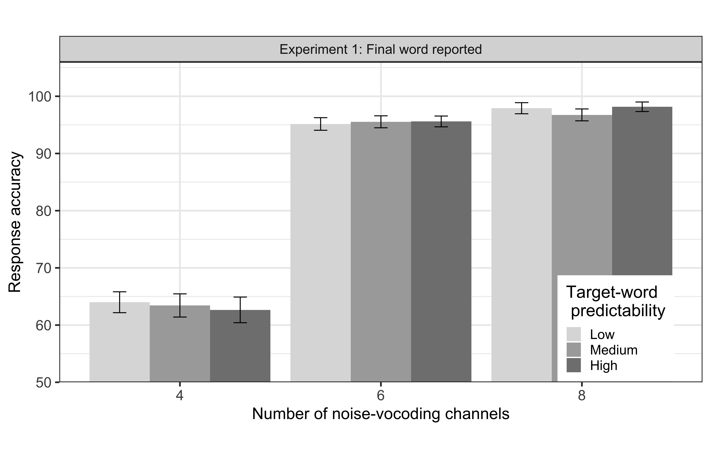

---
output:
  #bookdown::html_document2: default
  #bookdown::word_document2: default
  bookdown::pdf_document2: 
    template: templates/brief_template.tex
    citation_package: biblatex
documentclass: book
bibliography: [bibliography/references.bib, bibliography/additional-references.bib]
---

# Predictability effects of degraded speech are reduced as a function of attention {#chapter-attention-prediction}
\chaptermark{Attention-prediction interplay}

<!--In adverse listening conditions, when the bottom-up perceptual input is degraded, listeners tend to rely upon the context information.
They form top-down semantic predictions that facilitate comprehension of degraded speech.
However, -->
In adverse listening conditions, when the bottom-up perceptual input is degraded, listeners tend to rely upon the context information, and form top-down semantic predictions.
This provides contextual facilitation in understanding the degraded speech.
Importantly, it is moderated by top-down attentional allocation to the context.
The aim of this study was to examine the role of attention in understanding linguistic information in an adverse listening condition, i.e., when the speech was degraded.
To assess the role of attention we varied task instructions in two experiments in which participants were instructed to listen to short sentences and thereafter to type in the last word they heard or to type in the whole sentence.
We were interested in how these task instructions influence the interplay between top-down predictions and bottom-up perceptual processes during language comprehension.
The sentences varied in the degree of predictability (low, medium, high) as well as in the levels of speech degradation (1, 4, 6 and 8 channels noise vocoding).
Results indicated better word recognition for highly predictable sentences for moderate, though not for high, levels of speech degradation, but only when attention was directed to the whole sentence


## Introduction

In an adverse listening condition when there is noise in the signal,
listeners overcome the difficulty of understanding speech by using context information to support language comprehension.
<!--In optimal listening conditions, understanding speech is highly automatized and seemingly easy.
But conditions are often far from optimal in our day-to-day communication.
As simple as a weak internet connection can create an adverse listening condition, for example, in an online meeting.
Although the speech signal gets distorted or degraded at times, we do not frequently fail to understand such degraded speech.
Listeners overcome the difficulty and successfully understand the speech by using context information.-->
The 'context information' can be an information in a given situation about a topic of conversation, semantic and syntactic information of a sentence structure, world knowledge, visual information, etc. [@Kaiser2004; @Knoeferle2005; @Altmann2007; @Xiang2015; for reviews, @Ryskin2021; @Stilp2020].
However, to utilize the context information in a sentence, listeners must attend to it and build up a meaning representation of what has been said.

Processing and comprehending degraded speech is more effortful and requires more attentional resources than clear speech [@Wild2012; @Eckert2016; @Peelle2018].
In this chapter we examine how attention modulates the predictability effects brought about by context information at different levels of spectral degradation of speech.
We address the existing unclarity in the literature regarding the distribution of attentional resources in an adverse listening condition:
On the one hand, listeners can attend throughout the whole stream of speech and may thereby profit from the context information to predict sentence endings.
On the other hand, listeners can focus their attention on linguistic material at a particular time point in the speech stream and, as a result, miss critical parts of the sentence context.
If the goal is to understand a specific word in an utterance, there is a trade-off between allocating attentional resources to the perception of that word vs. allocating resources also to the understanding of the linguistic context and generating predictions.

The study reported in this chapter was conducted with an aim to investigate how the allocation of attentional resources induced by different task instructions influences language comprehension and, in particular, the use of context information in communication through a noisy channel, i.e., when the speech is degraded.
To examine the role of attention on predictive processing under degraded speech, we ran two experiments in which we manipulated the task instructions.
In [Experiment 1A](#experiment1a), participants were instructed to only repeat the final word of the sentence they heard,
while in [Experiment 1B](#experiment1b), they were instructed to repeat the whole sentence, and by this drawing attention to the entire sentence including the context.
In both experiments, we varied the degree of predictability of sentence endings as well as the degree of speech degradation.
<!-- In the following, we first summarize findings of studies that have investigated predictive language processing in the comprehension of degraded speech, and then results on the role of attention and task instruction in speech perception.  -->

## Background

As we have discussed earlier in [Chapter 1](#chapter-introduction) and [Chapter 2](#chapter-background), it is generally agreed upon that human language processing is predictive in nature, such that comprehenders generate expectations about upcoming linguistic materials based on context information [for reviews, @Kuperberg2016; @Nieuwland2019; @Pickering2018; @Staub2015].
When the bottom-up speech signal is less informative in an adverse listening condition, listeners tend to rely more on the context information to support language comprehension [@Amichetti2018; @Obleser2010; @Sheldon2008b].
However, it is not just the quality of speech signal that determines and influences the reliance and use of predictive processing;
attention to the auditory input is important as well.
Auditory attention allows a listener to focus on the speech signal of interest [for reviews, @Fritz2007; @Lange2013].
For instance, it has been shown that a listener can attend to and derive information from one stream of sound among many competing streams as demonstrated in the well-known *cocktail party effect* [@Cherry1953; @Hafter2007].
When a participant is instructed to attend to only one of the two or more competing speech streams in a diotic or dichotic presentation, response accuracy to the attended speech stream is higher than to the unattended speech [e.g., @Toth2020].
Similarly, when a listener is presented with a stream of tones (e.g., musical notes varying in pitch, pure tones of different harmonics) but attends to any one of the tones appearing at a specified time point, this is reflected in a larger amplitude of N1 [e.g., @Lange2010; see also, @Sanders2008]
which is the first negative going ERP component peaking around 100 ms post-stimulus considered as a marker of auditory selective attention [@Naatanen1987; @Thornton2007].
Hence, listeners can draw attention to and process one among multiple competing speech streams,
as well as orient their attention in temporal dimension within an unfolding sound stream.

So far, most previous studies have investigated listeners’ attention within a single speech stream by using acoustic cues like accentuation and prosodic emphasis.
For example, @Li2014 examined whether the comprehension of critical words in a sentence context was influenced by a linguistic attention probe such as “ba” presented together with an accented or a de-accented critical word.
The N1 amplitude was larger for words with such attention probe than for words without a probe.
These findings support the view that attention can be flexibly directed either by instructions towards a specific signal or by linguistic probes [@Li2017; see also, @Brunelliere2019].
Thus, listeners are able to select a part or segment of stream of auditory stimuli to selectively allocate their attention to.

The findings on the interplay of attention and prediction mentioned above come from studies most of which used a stream of clean speech or multiple streams of clean speech in their experiments.
They cannot tell us about the attention-prediction interplay in degraded speech comprehension.
Specifically, we do not know what role attention to a segment of speech stream plays in the contextual facilitation of degraded speech comprehension.
<!-- although separate lines of research show that listeners attend to most informative portion of speech stream [e.g., @Astheimer2011], and semantic predictability facilitates comprehension of degraded speech [e.g., @Obleser2010]. -->
The studies that report predictability effects in degraded speech comprehension do not systematically examine the role of attention [e.g., @Amichetti2018; @Obleser2010; @Sheldon2008b].
Their conclusions that *semantic predictability facilitates comprehension of degraded speech* are based on listeners' attention to the entire sentence
which is not compared to any other experimental condition manipulating attentional allocation.
In two experiments, we therefore examined whether context-based semantic predictions are automatic during effortful listening to degraded speech, when participants are instructed to report only the final word of the sentence, or the entire sentence.
We varied the task instructions to the listeners from [Experiment 1A](#experiment1a) to [Experiment 1B](#experiment1b) which required them to differentially attend to the target word (not binding the context), or to the target word including the context.
We hypothesized that when listeners pay attention only to the contextually predicted target word, they do not form top-down predictions, i.e., there should not be a facilitatory effect of target word predictability.
In contrast, when listeners attend to the whole sentence, they do form expectations such that the facilitatory effect of target word predictability will be observed replicating the prior findings.

## Experiment 1A {#experiment1a}

This experiment was designed such that processing the context was not strictly necessary for the task.
Listeners were asked to report the noun of the sentence that they heard which was in the final position of the sentence.
This instruction did not require listeners to pay attention to the context which preceded the target word.

## Methods

### Participants

We recruited 50 participants online via Prolific Academic.
One participant whose response accuracy was less than 50\% across all experimental conditions was removed from the analysis.
Among the remaining 49 participants ($\bar{x}\pm SD=23.31\pm 3.53$ years; age range = $18-30$ years), 27 were male and 22 were female.
They were all native speakers of German residing in Germany, and they did not have any speech-language disorder, hearing loss, or neurological disorder (all self-reported).
<!-- All participants received 6.20 Euro as monetary compensation for their participation. -->

### Materials

Materials used in the experiment were created by the method described in Chapter \@ref(chapter-methods) (Section \@ref(experimental-materials)).
<!-- [Chapter 3](#experimental-materials). -->
That is, there were 120 unique sentences in each of these 3 categories: low predictability, medium predictability and high predictability.
The mean cloze probabilities of the target words for low, medium and high predictability sentences were $0.022\pm0.027$ ($\bar{x}\pm SD$; range = $0.00-0.09$), $0.274\pm0.134$ ($\bar{x}\pm SD$; range = $0.1-0.55$), and $0.752\pm0.123$ ($\bar{x}\pm SD$; range = $0.56-1.00$) respectively.
All 360 sentences were then noise vocoded through 1, 4, 6, and 8 channels to create degraded speech.

Each participant was presented with 40 high predictability, 40 medium predictability, and 40 low predictability sentences.
Levels of speech degradation were also balanced across each predictability level, so that for each of the three predictability conditions (high, medium and low predictability), ten 1 channel, ten 4 channels, ten 6 channels, and ten 8 channels noise vocoded sentences were presented, resulting in 12 experimental lists.
The sentences in each list were pseudo-randomized so that no more than three sentences of same degradation and predictability condition appeared consecutively.
The lists are presented in Appendix B.

### Procedure

Participants were asked to use headphones or earphones.
A sample of noise vocoded speech not used in the practice trial and the main experiment was provided so that the participants could adjust the loudness to a preferred level of comfort at the beginning of the experiment.
They were instructed to listen to the sentences and to type in the target word (noun) by using the keyboard.
The time for typing in the response was not limited.
They were also informed at the beginning of the experiment that some of the sentences would be ‘noisy’ and not easy to understand, and in these cases, they were encouraged to guess what they might have heard.
Eight practice trials with different levels of speech degradation were given to familiarize the participants with the task before presenting all 120 experimental trials with an inter-trial interval of 1000 ms.
The experiment was approximately 40 minutes long.

## Analyses

<!-- We preprocessed and analysed data in R-Studio (Version 3.6.3; R Core Team, 2020). -->
Out of 5880 trials from 49 participants, there were only 5 correct responses at 1 channel speech degradation condition.
We excluded the trials from the 1 channel speech degradation condition from the analysis.

Response accuracy was analyzed with Generalized Linear Mixed Models (GLMMs) following the procedure described in Chapter \@ref(chapter-stats) (Section \@ref(analysis-main)).
<!-- [Chapter 4](#analysis-main). -->
Binary responses (correct/incorrect) for all participants were fit with a [binomial logistic mixed-effects model](#binomial-logistic-mixed-effects-model).
Noise condition (categorical; 4, 6, and 8 channels noise vocoding), target word predictability (categorical; high, medium, and low), and the interaction of number of channels and target word predictability were included in the fixed effects.
We applied treatment contrast for number of channels (8 channels as a baseline) and sliding difference contrast for target word predictability (low predictability vs. medium predictability, and low predictability vs. high predictability sentences).

## Results and discussion

Mean response accuracies (in proportion scale, or percentage scale) for all experimental conditions aggregated across all participants and items are shown in Table \@ref(summary1a) and Figure \@ref(fig:figure1a).
It shows that accuracy increases with an increase in the number of noise vocoding channels, i.e., with the decrease in speech degradation.
However, accuracy does not increase with an increase in target word predictability.
These observations aligned with the results of the statistical analyses (Table \@ref(results1a)).

\begin{longtable}[]{@{}llll@{}}
\caption{Mean response accuracy across all levels of speech degradation
and target word predictability in Experiment 1.}
\label{summary1a}
\tabularnewline
\toprule
Number of channels & Target word predictability & Mean & Standard
error \\
\midrule
\endfirsthead
\toprule
Number of channels & Target word predictability & Mean & Standard
error \\
\midrule
\endhead
4 & High & 62.65 & 2.24 \\
& Medium & 63.43 & 2.03 \\
& Low & 63.99 & 1.83 \\
6 & High & 95.60 & 0.94 \\
& Medium & 95.54 & 1.05 \\
& Low & 95.16 & 1.10 \\
8 & High & 98.16 & 0.84 \\
& Medium & 96.75 & 1.04 \\
& Low & 97.91 & 0.97 \\
\bottomrule
\end{longtable}

```{r figure1a, eval=TRUE, echo=FALSE, fig.align='center', fig.cap="Mean response accuracy across all conditions in Experiment 1A. Accuracy increased only with an increase in the number of noise vocoding channels. There is no change in accuracy with an increase or decrease in target word predictability. Error bars represent standard error of the means.", out.width="95%"}

```

We found that there was a significant main effect of number of channels, indicating that response accuracy in the 8 channels noise vocoded speech was higher than in both 4 channels ($\beta$ = -3.49, SE = .23, *z* (4246) = -15.30, *p* < .001) and 6 channels noise vocoded speech ($\beta$ = -.69, SE = .22, *z* (4320) = -3.12, *p* = .002).
That is, when the number of channels increased to 8, listeners made more correct responses.
However, there was no significant main effect of target word predictability ($\beta$ = -.07, SE = .17, *z* (4246) = -.42, *p* = .68, and $\beta$ = -.003, SE = .16, *z* (4246) = -.02, *p* = .98), and no significant interaction between number of noise vocoding channels and target word predictability (all *p*s > .05).

The results of Experiment 1A indicated a decrease in response accuracy with an increase in speech degradation from 8 channels to 6 channels noise vocoding condition, and from 8 channels to 4 channels noise vocoding condition.
However, response accuracy did not increase with an increase in target word predictability,
and the interaction between number of noise vocoding channels and target word predictability was also absent, in contrast to previous findings [e.g., @Obleser2007; @Obleser2011; see also @Hunter2018].
These results suggest that the task instruction, which asked participants to only report the final word, indeed lead to neglecting the context, and therefore the facilitatory effect of prediction was not observed.
However, to further test the hypothesis --- as mentioned in the beginning of this chapter --- that predictability effect is dependent on attentional effect, we conducted another experiment.
In the second experiment, we changed the task instruction to draw participants' attention to the entire sentence such that they could attend and decode the whole sentence including the context.

\begin{longtable}[]{@{}lllll@{}}
\caption{Estimated effects of the best fitting optimal model accounting
for the correct word recognition in Experiment 1A.}
\label{results1a}
\tabularnewline
\toprule
Fixed effects & Estimate & Std. Error & \emph{z} value & \emph{p}
value \\
\midrule
\endfirsthead
\toprule
Fixed effects & Estimate & Std. Error & \emph{z} value & \emph{p}
value \\
\midrule
\endhead
Intercept & 4.20 & .24 & 17.52 & \textless.001 \\
Noise condition (4 channels) & -3.49 & .23 & -15.30 & \textless.001 \\
Noise condition (6 channels) & -.69 & .22 & -3.12 & .002 \\
Target word predictability (Low-Medium) & .07 & .17 & .42 & .67 \\
Target word predictability (High-Low) & .003 & .16 & .02 & .98 \\
\bottomrule
\end{longtable}

## Experiment 1B {#experiment1b}

Following up on Experiment 1A, we conducted Experiment 1B on a separate group of participants with a different task instruction.
This experiment was intended to test the hypothesis that the facilitatory effect of top-down predictions is observed only when the listeners' attention is unrestricted such that the context information is also included within the attentional focus of a listener.

## Methods

### Participants and Materials

We recruited 48 participants ($\bar{x}\pm SD = 24.44 \pm 3.5$ years; age range = $18-31$ years; 32 males) online via Prolific Academic.
We used the same materials that were used in Experiment 1A.

### Procedure

We followed the same procedure as in Experiment 1A with one difference:
Instead of only the final word of a sentence, participants were asked to report the entire sentence by typing in what they heard.
Guessing was encouraged.

## Analyses

We followed the same data analyses procedure as in Experiment 1A.
The 1 channel noise vocoding condition was excluded from the analysis.
For the results of this experiment to be comparable with Experiment 1A,
we only considered the final words of the sentences (i.e., the target words) to be either correct or incorrect ---
accuracy of other preceding words were not considered in the analyses.

## Results and discussion

Mean response accuracy for different conditions are shown in Table \@ref(summary1b) and are displayed in Figure \@ref(fig:figure1b).
It shows that the accuracy increased with an increase in both the number of noise vocoding channels, and the target word predictability.

\begin{longtable}[]{@{}llll@{}}
\caption{Mean response accuracy across all levels of speech degradation
and target word predictability in Experiment 1B.}
\label{summary1b}
\tabularnewline
\toprule
Number of channels & Target word predictability & Mean & Standard
error \\
\midrule
\endfirsthead
\toprule
Number of channels & Target word predictability & Mean & Standard
error \\
\midrule
\endhead
4 & High & 62.71 & 2.14 \\
& Medium & 59.58 & 1.88 \\
& Low & 58.13 & 1.88 \\
6 & High & 96.88 & 0.93 \\
& Medium & 92.29 & 1.21 \\
& Low & 91.46 & 1.12 \\
8 & High & 98.54 & 0.86 \\
& Medium & 95.21 & 1.19 \\
& Low & 95.00 & 1.23 \\
\bottomrule
\end{longtable}

```{r figure1b, eval=TRUE, echo=FALSE, fig.align='center', fig.cap="Mean response accuracy across all conditions in Experiment 1B. Accuracy increased with an increase in number of noise vocoding channels and target word predictability. Error bars represent standard error of the means.", out.width="95%"}
knitr::include_graphics("figures/results-fig/expt-1b.jpg")
```

These observations aligned with the results of the statistical analyses (Table \@ref(results1b)).
We again found a main effect of number of noise vocoding channels such that response accuracy at 8 channels noise vocoding condition was higher than both 4 channels ($\beta$ = -3.49, SE = .23, *z* (4320) = -15.29, *p* < .001), and 6 channels noise vocoding conditions ($\beta$ = -0.61, SE = .20, *z* (4320) = -3.07, *p* = .002).
In contrast to Experiment 1A, there was also a main effect of target word predictability:
Response accuracy in high predictability sentences was significantly higher than in low predictability sentences ($\beta$ = 1.25, SE = .28, *z* (4320) = 4.50, *p* < .001).
We also found a statistically significant interaction between speech degradation and target word predictability ($\beta$ = -.95, SE = .30, *z* (4320) = -3.14, *p* = .002).
Subsequent subgroup analyses of each channel condition showed that the interaction was driven by the difference in response accuracy between high predictability sentences and low predictability sentences at 8 channels ($\beta$ = 1.42, SE = .62, *z* (1440) = 2.30, *p* = .02), and 6 channels noise vocoding conditions ($\beta$ = 1.14, SE = .34, *z* (1440) = 3.31, *p* < .001).<!--;
at 4 channels noise vocoding condition, the difference between high and low predictability sentences was not significant ($\beta$ = .28, SE = .18, *z* (1440) = 1.59, *p* = .11).-->

\begin{longtable}[]{@{}lllll@{}}
\caption{Estimated effects of the best fitting optimal model accounting
for the correct word recognition in Experiment 1B.}
\label{results1b}
\tabularnewline
\toprule
Fixed effects & Estimate & Std. Error & \emph{z} value & \emph{p}
value \\
\midrule
\endfirsthead
\toprule
Fixed effects & Estimate & Std. Error & \emph{z} value & \emph{p}
value \\
\midrule
\endhead
Intercept & 4.07 & .23 & 17.51 & \textless.001 \\
Noise condition (4 channels) & -3.49 & .23 & -15.29 & \textless.001 \\
Noise condition (6 channels) & -.61 & .20 & -3.07 & .002 \\
Target word predictability (Low-Medium) & -.10 & .16 & -.60 & .55 \\
Target word predictability (High-Low) & 1.25 & .28 & 4.50 &
\textless.001 \\
Noise condition $\times$ Target word predictability & -.95 & .30 & -3.14 &
\textless.001 \\
\bottomrule
\end{longtable}

In contrast to Experiment 1A, these results indicate an effect of target word predictability, that is, response accuracy was higher when the target word predictability was high as compared to low.
Also, the interaction between predictability and speech degradation, which was not observed in Experiment 1A, showed that semantic predictability facilitated the comprehension of degraded speech already at moderate degradation levels (like, 6 and 8 noise vocoding channels).
In line with the findings from Experiment 1A, response accuracy was better with a higher number of channels.

To test whether the difference between experimental manipulations is statistically significant, we combined the data from both the experiments in a single analysis.
We ran another binomial linear mixed-effects model on response accuracy and followed the same procedure as Experiment 1A and Experiment 1B to obtain the optimal model.
The model summary is shown in Table \@ref(results1ab).

\begin{longtable}[]{@{}lllll@{}}
\caption{Estimated effects of the best fitting optimal model accounting for the correct word recognition in both the experiments.}
\label{results1ab}
\tabularnewline
\toprule
Fixed effects & Estimate & Std. Error & \emph{z} value & \emph{p}
value \\
\midrule
\endfirsthead
\toprule
Fixed effects & Estimate & Std. Error & \emph{z} value & \emph{p}
value \\
\midrule
\endhead
Intercept & 4.09 & .23 & 17.41 & \textless.001 \\
Noise condition (4 channels) & -3.49 & .23 & -15.16 & \textless.001 \\
Noise condition (6 channels) & -.58 & .22 & -2.67 & .008 \\
Target word predictability (Low-Medium) & .15 & .27 & .57 & .57 \\
Target word predictability (High-Low) & 1.09 & .35 & 3.11 &
\textless.002 \\
Experimental group & .19 & .28 & .70 & .49 \\
Noise condition (4 channels) $\times$ Target word predictability (Low-Medium) & -.15 & .30 & -.51 &
.61 \\
Noise condition (6 channels) $\times$ Target word predictability (Low-Medium) & -.30 & .35 & -.87 &
.39 \\
Noise condition (4 channels) $\times$ Target word predictability (High-Low) & -.73 & .36 & -2.05 &
.04 \\
Noise condition (6 channels) $\times$ Target word predictability (High-Low) & -.12 & .40 & -.32 &
.75 \\
Noise condition (4 channels) $\times$ Experimental group & -.11 & .27 & -.42 &
.67 \\
Noise condition (6 channels) $\times$ Experimental group & -.11 & .30 & -.36 &
.72 \\
Target word predictability (High-Low) $\times$ Experimental group & -.45 & .18 & -2.55 &
.011 \\
\bottomrule
\end{longtable}

The model revealed that the critical interaction between experimental manipulation and target word predictability was indeed statistically significant ($\beta$ = -.45, SE = .18, *z* (8566) = -2.55, *p* = .011), i.e., the effect of predictability was larger in the group that was asked to type in the whole sentence.
Together, these findings suggest that the change in task instruction, which draws attention either to the entire sentence or only to the final word, is critical for making use of the context information under degraded speech.

## Conclusion

The main goals of the present study were to investigate whether online semantic predictions are formed in comprehension of degraded speech when task instructions encourage attention to the processing of the context information, or only to the critical target word.
The results of two experiments revealed that attentional processes clearly modulate the use of context information for predicting sentence endings when the speech signal is degraded. <!--moderately degraded.-->

In contrast to the first experiment, the results of the second experiment show an interaction between target word predictability and degraded speech.
This is in line with existing studies that found a facilitatory effect of predictability at different levels of speech degradation when the participants were instructed to pay attention to the entire sentence [e.g., at 4 channels or 8 channels noise vocoded speech, @Obleser2007; @Obleser2010].
Obleser and colleagues reported that at moderate levels of degradation, key word recognition was higher for high predictability sentences than for low predictability sentences.
Listeners were required to attend to the entire sentence in those studies as well.
Therefore, the findings of Experiment 1B replicate this facilitatory effect of predictability.

The important new finding that our study adds to the present literature is that this predictability effect may be weakened or even lost, when listeners are instructed to report only the final word of the sentence that they heard, like in Experiment 1A.
The lack of predictability effect and contextual facilitation can most likely be attributed to listeners not successfully decoding the meaning of the verb of the sentence, as the verb is the primary predictive cue for the target word (noun) in our stimuli (e.g., Sie jongliert die Baelle).
Findings from auditory attention literature also support this explanation.
When listeners' attention is focused on one feature of an auditory stimuli, the rest are not attended to and they are not processed [filter mechanism of attention, @Lange2013]

Hence, a small change in task instruction from Experiment 1A to Experiment 1B sheds light on the role of top-down regulation of attention on using context for language comprehension in a noisy channel.
In the noisy channel when listening conditions are adverse, language comprehension is generally effortful such that focusing attention to only a part of the speech signal seems much beneficial in order to enhance stimulus decoding.
However, the results of this study also show that this comes at the cost of neglecting the context information that could be beneficial for language comprehension.
Our findings hence demonstrate that there is a trade-off between the use of context for generating top-down predictions vs. focusing all attention on a target word.
Specifically, the engagement in the use of context and generation of top-down predictions may change as a function of attention [see also, @Li2014].
This claim is also corroborated by the significant change in predictability effects (or contextual facilitation) from Experiment 1A to Experiment 1B, in the combined dataset.
<!--
At this point we note the differences in response accuracies across different levels of speech degradation, and contextual facilitation therein.
At 8 channels, the speech was least degraded, and listeners recognized more words than in the 4 and 6 channels noise vocoded conditions, which is in line with prior studies that have found an increase in intelligibility and word recognition with an increase in number of channels [@Davis2005; @Obleser2011].
Speech signal passed through 4 channels noise vocoding was the most degraded after excluding the 1 channel noise vocoded speech for analyses.
Therefore, in the second experiment, at 4 channels, attending to the entire sentence did not confer contextual facilitation because decoding the context itself was difficult.
Listeners could not utilize the context differentially across high and low predictability sentences to generate semantic predictions.
At 6 channels -- a moderate level of degradation -- listeners could attend to, identify, and decode the context; hence we observed the significant difference in response accuracy between high and low predictability sentences.
We observed a similar contextual facilitation at 8 channels as well.
This is in line with previous findings which show that predictability effects can be observed at moderate degradation level of 8 channels noise vocoding or less [e.g., @Obleser2007; cf. @Obleser2010].
To summarize, our results indicate that there was a very strong difference in intelligibility between 4 and 6 channels, but that the difference in intelligibility between 6 and 8 channels was minimal.
Note though that even for 8 channels, low predictability sentences were not always understood correctly.-->

Considering the theoretical accounts of predictive language processing [@Mcclelland1986; @Kuperberg2016; @Norris2016; @Pickering2018; @Friston2020], one would expect that listeners automatically form top-down predictions about upcoming linguistic stimuli based on prior context.
Also, when speech is degraded, top-down predictions render a benefit in word recognition and language comprehension [e.g., @Sheldon2008a; @Sheldon2008b].
Results of our study revealed new theoretical insights by showing that this is not always the case.
Top-down predictions are dependent on attentional processes [see also, @Kok2012], directed by task instructions.
Thus, they are not *always* automatic, and predictability does not *always* facilitate language comprehension when speech is degraded.
To this point, our findings add to the growing body of literature that indicate limitations of predictive language processing accounts [@Mishra2012; @Huettig2016; @Nieuwland2018; @Huettig2019].

<!--A limitation of the current study should also be noted.
In our experiments, we have used short Subject-Verb-Object sentences in which the verb is predictive of the noun; and we have given participants somewhat unnatural task of reporting the last word of a sentence.
In a more naturalistic sentence comprehension task, participants would normally aim to understand a full utterance, and would most likely not have restricted goals such as first and foremost decoding a word in a specific position of the sentence.
Instead, the speaker would usually indicate important words or concepts via pitch contours, stress, or intonation patterns, which would then direct the attention of a listener.
Furthermore, the sentences uttered in most of the day-to-day conversations are longer, and context information builds up more gradually -- information from several words is usually jointly predictive of upcoming linguistic units.-->

<!-- ## Conclusions -->

In conclusion, this study provides a novel insight into the modulatory role of attention regulation in the interaction between top-down predictive and bottom-up auditory processes.
We show that task instructions affect distribution of attention to the degraded speech signal.
This, in turn, means that when insufficient attention is given to the context, top-down predictions cannot be generated, and the facilitatory effect of predictability is substantially reduced.
The findings of this study indicate limitations to predictive processing accounts of language comprehension.

## Summary

This chapter replicated the previous finding that semantic predictability facilitates language comprehension at moderate levels of speech degradation.
That is, when the channel of transmission $N$ is noisy,
listeners put less weight on the degraded auditory input $P(u_p|u_i,N)$ and
more weight on the prior $P(u_i,m_i)$ derived from the context information that facilitates language comprehension.
Importantly,
we found in this chapter that the contextual facilitation (i.e., facilitatory effect of predictability) is observed only when the listeners attend to the entire sentence, including the context.
<!--For an equivalent comparison of results across two experiments,
the recognition of context (in Experiment 2) was not taken into account in the data analysis.
In the next chapter, this limitation is overcome.-->
In the next chapter, we further investigate this effect,
specifically, we examine the granularity of predictability effect.
We also examine if perceptual adaptation affects contextual facilitation.
