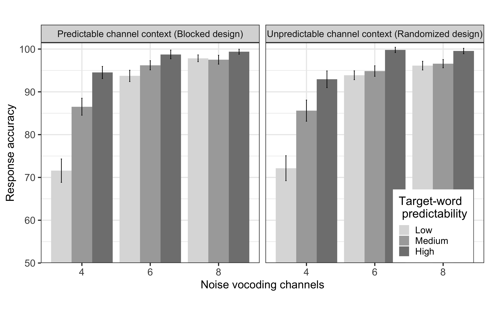

---
output:
  #bookdown::html_document2: default
  #bookdown::word_document2: default
  bookdown::pdf_document2: 
    template: templates/brief_template.tex
    citation_package: biblatex
    latex_engine: xelatex
documentclass: book
bibliography: [bibliography/references.bib, bibliography/additional-references.bib]
---
  
# Semantic predictability facilitates comprehension of degraded speech in a graded manner {#chapter-graded-prediction}
\chaptermark{Graded effect of predictability}

In the previous chapter we concluded that in a noisy channel, predictability facilitates comprehension of degraded speech only when listeners attended to the context.
We also pointed out a few limitations of the study.
In Experiment [2](#experiment1b) of Chapter \@ref(chapter-attention-prediction), there was an implicit assumption that all the noun-correct responses were borne out of a correct identification of the context evoking words (i.e., verbs).
For a comparable analysis and results between Experiments 1 and 2, we only considered the accuracy of noun identification.
In this chapter, we take into account listeners' identification of context (i.e., a verb that precedes the noun) while calculating the response accuracy.
Importantly, we replicated the predictability effects in degraded speech comprehension in the previous chapter, showing a difference between comprehension of high and low predictability sentences.
In this chapter, we extend it further and examine if the predictability is graded or all-or-nothing.
We only showed that listeners do not adapt to degraded speech when there is a trial-by-trial variability in speech degradation.
Here we report two experiments, investigating if listeners' adaptation to degraded speech is affected by such variability by comparing it against another condition in which speech degradation is kept constant.
The results showed that in contrast to the "narrowed expectations" view postulated for the predictive processing of degraded speech,
listeners probabilistically preactivate upcoming words from a wide range of semantic space, not limiting only to the highly probable sentence endings.
We also did not find any learning effect on repeated exposure to degraded speech.
We speculate that when there is a trial-by-trial variation in semantic feature (e.g., sentence predictability), listeners do not adapt to low-level perceptual property (e.g., speech quality) regardless of the certainty about the degradation level.

## Introduction

In the literature of speech perception and sentence processing, studies have argued that prediction is either probabilistic and graded, or it is an all-or-nothing phenomenon [e.g., @Coltheart2004; @Kuperberg2016; @Luke2016].
Very few studies have investigated such theoretical questions within the domain of adverse listening conditions, specifically in degraded speech comprehension [e.g., @Corps2020; @Strauss2013; cf. @vanOs2021].
@Strauss2013 posited that listeners cannot preactivate less predictable sentence endings in an adverse listening condition.
They proposed that the facilitatory effect of predictability is limited to only highly predictable sentence endings at a moderate level of spectral degradation of speech.
Although many studies support the general idea of Strau\ss\ and colleagues that predictability facilitates comprehension of degraded speech [e.g., @Hunter2018; @Obleser2010; @Sheldon2008a],
there have been no studies so far after Strau\ss\ and colleagues', to our knowledge, which examined the nature of predictability specifically in degraded speech comprehension.

In this chapter, our main aim is to attempt a replication of the previous findings of these predictability effects
and extend them further by testing if listeners form narrowed expectations while listening to moderately degraded speech.
In line with @Strauss2013's argument, listeners can form predictions that are restricted to only highly probable sentence endings.
On the opposite, listeners can generate expectations about an upcoming word based on how likely the word is to appear in the given context,
and hence form a probabilistic prediction.
We also test the presence of perceptual adaptation and its interplay with contextual facilitation.
We set a metric of measurement of language comprehension that considers whether listeners correctly identified the context information.

## Background

### Predictability effects in degraded speech perception

We discussed in Chapter \@ref(chapter-background) (Section \@ref(background-facilitatory-effect))
that some studies [@Obleser2007; @Obleser2010; @Sheldon2008a; see also @Hunter2018] have already shown the facilitatory effect of predictability in comprehension of degraded speech.
For example, Obleser and colleagues compared high and low predictability sentences and observed contextual facilitation, in terms of the difference in response accuracy between high and low predictability sentences, at 8 channels and 4 channels noise-vocoded speech in their [-@Obleser2007] and [-@Obleser2010] studies respectively.
However, these neuroimaging studies were not designed to test the nature of predictability effects. <!--"narrowed expectations" account that was proposed in the *expectancy searchlight model* of @Strauss2013.-->

In a modified experimental design, @Strauss2013 varied the target word predictability by manipulating its expectancy (i.e., how expected the target word is given the verb) and typicality (i.e., co-occurrence of target word and the preceding verb).
They reported that at a moderate level of spectral degradation, N400 responses at highly predictable (strong-context and high-typical) words were smallest.
In contrast, they found that the N400 effect (in terms of the amplitude of the N400 component) were largest at the strong-context, low typical words and the weak-context, low-typical words;
the responses at the latter two were not statistically different from each other.
The authors interpreted these findings as a facilitatory effect of sentence predictability which might be limited to only highly predictable sentence endings at a moderate level of spectral degradation.
They proposed it as an *expectancy searchlight model*, and suggested that listeners form *narrowed expectations* from a restricted semantic space when the sentence endings are highly predictable.
Their model posits that when the sentence endings are less predictable, listeners cannot preactivate those less predictable sentence endings in an adverse listening condition, namely, a severe spectral degradation.
It is similar to the earlier observations made by @Rayner2006 [see @Brothers2021 for discussion], who found that reading times at low and medium predictability words were shorter than high predictability words,
but it is contrary to the view that readers and listeners form a probabilistic prediction of upcoming word in a sentence.
For example, @Nieuwland2018[^replication-failure] showed in a large-scale replication study of @Delong2005 that the N400 amplitude at the sentence-final noun is directly proportional to its cloze probability across a range of high- and low-cloze words [see also @Kochari2019; @Nicenboim2020].
@Heilbron2022 also showed that a probabilistic prediction model outperforms a constrained guessing model in predicting listeners' neural activities (MEG and EEG recordings),
suggesting that linguistic prediction is probabilistic and it is not limited only to the highly predictable sentence endings, but it operates broadly in a wide range of probable sentence endings.
However, when put in perspective with our research question, these studies were conducted in conditions without noise or degraded speech.
And the ones that examined degraded speech comprehension used only two levels of semantic predictability (high and low).
The granularity and the nature of prediction remain to be tested in degraded speech comprehension.

### Adaptation to degraded speech

We discussed in Chpater \@ref(chapter-background) that studies have shown evidence for perceptual adaptation to artificially distorted speech.
When exposed to noise-vocoded speech, listeners’ word recognition accuracy is shown to increase over the course of experiment.
@Davis2005 and @Erb2013 presented participants with 4- and 6-channel noise-vocoded speech, respectively in a single block.
They found that the proportion of correctly reported words increased over the course of the experiment.
It is important to note that in these experiments, listeners were not uncertain about the speech quality of any upcoming trial,
i.e., the *global channel context* was certain or predictable.
Additionally, there was no systematic variation of the semantic features of the words presented to the participants.

Listeners gradually map the representation of degraded lexicons around their "true" (or clear) schema/exemplars on repeated exposure [@Goldstone1998; @Nosofsky1986].
With repeated exposure, the representation of degraded input comes closer to the exemplar, thereby, improving the performance.
This feature-mapping mechanism proposes that the listeners map the whole feature of the sensory input.
<!-- However, this proposed feature mapping mechanism of perceptual adaptation does not specify what features of speech listeners have to focus on to map the degraded speech to the ideal exemplar. -->
However, the higher level features of a speech (e.g., semantic property, like predictability) can also influence the acoustic realization of a degraded word,
i.e., bottom-up processing of the degraded speech and perceptual adaptation [@Goldstone1998; @Gold2010; cf. @Nahum2008].
Listeners can assign weight to different dimensions of a speech stimuli (acoustic-phonetic and lexical-semantic).
Performance improves over time when listeners give more attentional weight to the acoustic-phonetic dimension [cf. @Haider1996].

Thus, when multiple levels of degraded speech signals are presented in a (pseudo-)randomized order, then the listener is uncertain about the speech quality of any upcoming trial, i.e., the *global channel context* is certain or predictable.
<!-- If such multiple levels of degradation are due to the presentation of multiple channels of noise-vocoded speech, then the global channel context is unpredictable or uncertain. -->
Such changes in the auditory features of the speech signal throughout the experiment is likely to render the perceptual adaptation totally absent [@Mattys2012].
Additionally, the trial-by-trial variability in the characteristics of speech signal can also impair word recognition [@Sommers1994; see also @Dahan2006].
Very few studies have tried to study the influence of (un)certaintly about next-trial speech quality, and semantic feature in perceptual adaptation.
For example, in a study by @Vaden2013, participants were presented with words in a background noise at +3dB SNR and +10dB SNR in a pseudo-random order.
They argued that an adaptive control system is involved to optimize task performance when there is an uncertainty about next trial.
Similarly, Obleser and colleagues [@Obleser2007; @Obleser2010; @Hartwigsen2015] also presented listeners with multiple noise-vocoded speech (ranging from 2 to 32 channels noise-vocoding) in a pseudo-random order.
However, none of these studies reported the change in listeners' performance over the course of the experiment.
So, we cannont derive a conclusion from these studies regarding the effect of (un)certainty of the *global channel context* in perceptual adaptation and contextual facilitation.

As previously mentioned in Chapter \@ref(chapter-background) (Section \@ref(background-adaptation)), there are two conflicting findings in the literature on perceptual adaptation:
On the one hand, repeated exposure to degraded speech leads to perceptual adaptation, and consequently improves word recognition over the course of experiment.
On the other hand, uncertainty about next-trial speech quality is detrimental to word recognition.


### Measurement of language comprehension {#chapter-6-measurement}

How we measure language comprehension has rarely been guided by any specific theoretical motive in the existing literature [cf. @Amichetti2018].
There is a discrepancy across studies in how language comprehension in degraded speech in quantified.
Some studies that reported contextual facilitation in degraded speech comprehension used proportion of correctly reported *final* words only [e.g., @Hunter2018; @Obleser2010; @Sheldon2008a].
@Obleser2007 quantified language comprehension as the proportion of correctly identified key words in SPIN sentences.
@Erb2013 and @Hakonen2017 used *report scores* [@Peelle2013] that measure proportion of correctly recognized words per sentence as an index of language comprehension.
Such inconsistencies make cross-study comparison difficult.
None of the metrics outlined here take into account if listeners have correctly identified the context, which should be the most important factor to be considered in the first place.
It is clear that if the context is misidentified, then the listeners are highly likely to misidentify the succeeding words [@Marrufo2019].

### The present study

Stemming from the results of Chapter \@ref(chapter-attention-prediction), and from the motivations outlined in the beginning of this chapter, the goals of the present study were threefold:
The first goal was to attemnt to replicate the facilitatory effect of predictability examining the nature of predictability, i.e., to test if listeners form narrowed expectations.
Obleser and colleagues [e.g., @Obleser2007; @Obleser2010] have shown predictability effects (or contextual facilitation) to appear only at a moderate level of speech degradation by using only two levels of predictability (low and high).
Our use of three levels of target word predictability (low, medium and high) will let us test the narrowed expectations view [@Strauss2013] by also taking into account the accuracy of context.
If the listeners form narrowed predictions only for the target words with high cloze probability, then the facilitatory effect of semantic prediction will be observed only at these highly predictable sentence endings.
Listeners’ response to the target words with medium and low cloze probability would be quite similar, since these two fall out of the range of narrow prediction.
However, if the listeners’ predictions are not restricted to highly predictable target words, then they form predictions across a wide range of context proportional to the probability of occurrence of the target word.
In addition to highly predictable sentence endings, listeners will also form predictions for less predictable sentence endings.
Such predictions will depend on the probability of occurrence of the target words.
In other words, listeners form predictions also for less expected sentence endings;
and the semantic space of prediction depends on the probability of occurrence of those sentence endings.
In contrast to prior studies [e.g., @Obleser2010], inclusion of sentences with medium cloze target words thus allows us to differentiate whether listeners form all-or-nothing prediction restricted to high cloze target words, or a probabilistic prediction for words across a wide range of cloze probability.

There is a variation in the sentences we use, i.e., they are low, medium and high predictability sentences, and they are degraded at different levels of spectral degradation.
So our second goal was to investigate the role of uncertainty about next-trial speech features on perceptual adaptation by varying the global channel context on the comprehension of degraded speech.
To study this, we presented sentences randomized across all levels of predictability, but
i) blocked by each noise-vocoding channel, i.e. spectral degradation (*predictable channel context*) and
ii) pseudo-randomized across all noise-vocoding channels (*unpredictable channel context*).
Based on the previous findings, we expected that in the unpredictable channel context (i.e., when sentences are presented in a random order of spectral degradation) participants’ word recognition performance will be worse than in the predictable channel context [i.e., when the sentences are blocked by noise-vocoding, @Garrido2011; @Sommers1994; @Vaden2013].
To further examine perceptual adaptation, we also considered the effect of trial number in the analyses.

And third, we aimed at measuring language comprehension with a metric that reflects the participants' correct or incorrect identification of the context.
If participants do not understand the context and we only measure the recognition of final word, this might not truly reflect the effect of contextual facilitation.

## Methods

### Participants

We recruited a group of participant via Prolific Academic [@Prolific] and assigned them to the *predictable channel context* (n = 50; $M$ age $\pm SD=23.6\pm$ 3.2 years; age range = 18-30 years; 14 females).
Another group of 48 participants (n = 48; $M$ age $\pm SD=24.44\pm$ 3.5 years; age range = 18-31 years; 16 females) from [Experiment 2](#experiment1b) of Chapter \@ref(chapter-attention-prediction) were recruited and assigned to the *unpredictable channel context*.
All participants were native speakers of German and reportedly did not have any speech-language disorder, hearing loss, or neurological disorder.
They received a monetary compensation of 6.20 Euro for their participation in the approximately 40 minutes long experiment.

### Materials

We used the same stimuli described in Chapter \@ref(chapter-methods) (Section \@ref(experimental-materials)).
120 sentences each for low predictability, medium predictability, and high predictability sentences that differed in the cloze probability of sentence final target words were used.
Their mean cloze probabilities in the low, medium and high predictability sentences were $0.022\pm0.027$ ($M\pm SD$; range = $0.00-0.09$), $0.274\pm0.134$ ($M\pm SD$; range = $0.1-0.55$), and $0.752\pm0.123$ ($M\pm SD$; range = $0.56-1.00$), respectively.
All 360 sentences were then noise-vocoded through 1, 4, 6, and 8 channels to create degraded speech.

In the unpredictable channel context, each participant was presented with 120 unique sentences: 40 low predictability, 40 medium predictability, and 40 high predictability sentences.
Channel condition (i.e., degradation level) was also balanced across each sentence type, i.e., in each of low, medium, and high predictability sentences, 10 sentences passed through each noise-vocoding channels --- 1, 4, 6, and 8 --- were presented.
This resulted into 12 experimental lists.
The sentences in each list were pseudo-randomized, that is, not more than three sentences of same noise condition (i.e., same noise-vocoding channel), or same predictability condition appeared consecutively.
This randomization confirmed the uncertainty of next-trial speech quality (or degradation) in the global context of the experiment.

The same set of stimuli and experimental lists were used in the predictable channel context.

Each participant was presented with 120 unique sentences blocked by channel conditions, i.e., blocked by noise-vocoding channels.
There were four blocks of stimuli, one for each channel condition (i.e., degradation level).
Thirty sentences were presented in each of the four blocks.
In the first block, all sentences were 8 channels noise-vocoded, followed by the blocks of 6 channels, 4 channels, and 1 channel noise-vocoded speech consecutively [@Sheldon2008a].
Within each block, 10 low predictability, 10 medium predictability and 10 high predictability sentences were presented.
All the sentences were pseudo-randomized so that not more than three sentences of the same predictability condition appeared consecutively in each block.
This confirmed there was a certainty of next-trial speech quality (within each block) and an uncertainty of next-trial sentence predictability across all four blocks.

### Procedure

Participants were asked to use earphones or headphones.
A sample of vocoded speech not used in the practice trial or the main experiment was presented to adjust the volume to their preferred level of comfort at the beginning of the experiment.
The participants were instructed to listen and report the entire sentences by typing in the everything they heard using the keyboard.
The time for typing in the response was not limited.
They were informed at the beginning of the experiment that some of the sentences would be ‘noisy’ and not easy to understand.
In these cases, guessing was encouraged.
Eight practice trials with different levels of speech degradation were provided to the participants to familiarize them with the task before presenting all 120 experimental trials with an intertrial interval of 1,000 ms.

Each participant were presented with 40 high predictability, 40 medium predictability, and 40 low predictability sentences and the levels of speech degradation were balanced across each predictability level.
For each of the three predictability conditions (high, medium, and low predictability), ten 1-channel, ten 4-channel, ten 6-channel, and ten 8-channel noise-vocoded sentences were presented, resulting in a total of 30 sentences at each degradation level.
In the *unpredictable channel context*, the sentences were pseudo-randomized across degradation predictability conditions.
No more than three sentences of the same degradation and predictability condition appeared consecutively.
In the *predictable channel context*, sentences in were blocked by degradation level.
There were four blocks corresponding to each degradation level.
Within each block, predictability was randomized such that no more than three sentences of the same predictability condition appeared consecutively.
The lists of both unpredictable and predictable channel contexts are presented in Appendix B and C.

## Analyses

In the sentences used in our experiment, verbs evoke predictability of the sentence-final noun.
Therefore, the effect of predictability (evoked by the verb) on language comprehension can be rightfully measured if we consider only those trials in which participants identify the verbs correctly.
Verb-correct trials were considered as the sentence in which participants identified the context independent of the succeeding words.
Morphological inflections and typos were considered as correct.
We first filtered out those trials in which verbs were not identified correctly, i.e., trials with incorrect verbs.
Therefore, we excluded 2469 out of 5760 trials in unpredictable channel context and 2374 out of 6000 trials in predictable channel context from the analyses.
The 1-channel noise-vocoding condition was dropped from the analyses as there were no correct responses in any of the remaining trials in this condition.

Accuracy was analyzed using Generalized Linear Mixed Models (GLMMs) with lmerTest [@Kuznetsova2017] and lme4 [@Bates2015] packages.
Binary responses (categorical: correct and incorrect) for all participants in both groups (predictable and unpredictable channel contexts) were fit with a [binomial linear mixed-effects model](#binomial-logistic-mixed-effects-model).
Correct responses were coded as 1, and incorrect responses were coded as 0.
Number of channels (categorical: 4-channel, 6-channel, and 8-channel noise-vocoding), target word predictability (categorical: high predictability, medium predictability, and low predictability), global channel context (categorical: predictable channel context and unpredictable channel context) and the interaction of number of channels and target word predictability were included in the fixed effects.

Separately for each group (i.e., for predictable and unpredictable channel context), we first fitted a model with a maximal random effects structure that included random intercepts for each participant and item [@Barr2013].
Both by-participant and by-item random slopes were included for number of channels, target word predictability, and their interaction,
which was supported by the experiment design.
Following the procedure described in Chapter \@ref(chapter-stats) (Section \@ref(analysis-main)),
we selected the optimal model, not necessarily the maximal model, that best fit our data.
<!-- The same procedure was followed with all the subgroup analyses and post-hoc analyses reported in the *Results and discussion* section below. -->
We applied treatment contrast for number of channels (8-channel as a baseline; factor levels: 8-channel, 4-channel, 6-channel) and sliding difference contrast for target word predictability (low vs medium predictability and low vs high predictability) and channel context (factor levels: unpredictable vs predictable).

## Results and discussion

<!--In this experiment, we tested i) whether predictability facilitates language comprehension only at a moderate level of spectral degradation, and ii) whether adaptation to degraded speech influences language comprehension.-->
Mean response accuracy for different conditions in both channel contexts is shown in Tables \@ref(summarypredictable), \@ref(summaryunpredictable),  and Figure \@ref(fig:figure2).
We found that accuracy increased when the number of noise-vocoding channels increased, and when the target word predictability increased.
The results of the statistical analysis confirmed these observations (Table \@ref(results2)).

\begin{longtable}[]{@{}lllc@{}}
\caption{Response accuracy (mean and standard error of the mean) across all levels of speech degradation and target word predictability in the predictable channel context}
\label{summarypredictable}
\tabularnewline
\toprule
Number of channels & Target word predictability & Mean & Standard
error \\
\midrule
\endfirsthead
\toprule
Number of channels & Target word predictability & Mean & Standard
error \\
\midrule
\endhead
4 & Low & 71.59 & 2.74 \\
& Medium & 86.53 & 1.99 \\
& High & 93.53 & 1.42 \\
6 & Low & 93.73 & 1.33 \\
& Medium & 96.21 & 1.08 \\
& High & 98.75 & 1.02 \\
8 & Low & 97.84 & 0.80 \\
& Medium & 97.52 & 1.04 \\
& High & 99.38 & 0.59 \\
\bottomrule
\end{longtable}

\begin{longtable}[]{@{}lllc@{}}
\caption{Response accuracy (mean and standard error of the mean) across all levels of speech degradation and target word predictability in the unpredictable channel context}
\label{summaryunpredictable}
\tabularnewline
\toprule
Number of channels & Target word predictability & Mean & Standard
error \\
\midrule
\endfirsthead
\toprule
Number of channels & Target word predictability & Mean & Standard
error \\
\midrule
\endhead
4 & Low & 72.16 & 2.93 \\
& Medium & 85.61 & 2.47 \\
& High & 92.94 & 1.96 \\
6 & Low & 93.88 & 1.04 \\
& Medium & 94.86 & 1.24 \\
& High & 99.81 & 0.62 \\
8 & Low & 96.14 & 1.02 \\
& Medium & 96.59 & 0.97 \\
& High & 99.55 & 0.64 \\
\bottomrule
\end{longtable}

```{r figure2, eval=TRUE, echo=FALSE, fig.align='center', fig.cap="Mean response accuracy across all conditions in Experiment 2. Accuracy increased only with an increase in the number of noise-vocoding channels in both channel contexts. Only in the unpredictable globlal channel context, at the 4-channel noise-vocoding condition, we find a graded effect of prediction. Error bars represent the standard error of the means.", out.width="95%"}

```

We found a significant main effect of number of channels.
The response accuracy at 8-channel was higher than for both 4-channel
($\beta$ = -2.87, SE = .22, *z*(6917) = -13.1, *p* <.001),
and 6-channel noise-vocoding ($\beta$ = -.66, SE = .19, *z*(6917) = -3.42, *p* < .001).
<!-- However, the main effect of trial number was not significant
($\beta$ = .002, SE = .002, *z*(4,320) = 1.11, *p* = .27) indicating that the response accuracy did not increase over the course of the experiment. -->
There was a significant main effect of target word predictability suggesting that
the response accuracy in low predictability sentences was lower than in high predictability sentences
($\beta$ = 2.18, SE = .3, *z*(6917) = 7.2, *p* < .001) and medium predictability sentences
($\beta$ = -.52, SE = .27, *z*(6917) = -1.97, *p* = .049).

\begin{table}[ht]
\begin{center}
\caption{Estimated effects of the model accounting for the correct word recognition}
\label{results2} 
\vskip 0.12in
\begin{tabular}[]{@{}lrrrr@{}}
\toprule
Fixed effects & Estimate & Std. Error & \emph{z} value & \emph{p}
value \\
\midrule
Intercept & 5.09 & .24 & 21.38 & \textless.001 \\
\\
Noise condition (4-channel) & -2.87 & .22 & -13.10 & \textless.001 \\
\\
Noise condition (6-channel) & -.66 & .19 & -3.42 & .001 \\
\\
Target word predictability (Low-Medium) & -.52 & .27 & -1.97 & .049 \\
\\
Target word predictability (High-Low) & 2.18 & .30 & 7.21 & \textless.001 \\
\\
Noise condition (4-channel) $\times$ & -.71 & .29 & -2.44 & .015 \\
Target word predictability (Low-Medium) \\
\\
Global channel context $\times$ & -..27 & .14 & -2.02 & .043 \\
(Unpredictable - Predictable) \\
\bottomrule
\end{tabular} 
\end{center} 
\end{table}

We also found a significant interaction between number of channels and target word predictability
($\beta$ = -.71, SE = .29, *z*(6917) = -2.44, *p* = .015).
The interaction was driven by the effect of predictability at 4-channel condition:
The accuracy in high predictability sentences was higher than in medium predictability sentences
($\beta$ = 1.14, SE = .37, *z*(1608) = 3.1, *p* < .001) which in turn was higher than low predictability sentences
($\beta$ = 1, SE = .24, *z*(1608) = 4.2, *p* < .001).
There was no significant difference in response accuracy between low predictability and high predictability sentences
at both 6-channel ($\beta$ = .33, SE = .32, *z*(2590) = 1.04, *p* = .3)
and 8-channel ($\beta$ = -.014, SE = .32, *z*(2719) = -.04, *p* = .97) conditions.
<!--However, response accuracy was higher in high predictability than in medium predictability sentences
at both 6 channels ($\beta$ = 1.83, SE = .65, *z*(2590) = 2.83, p < .005)
and 8 channels ($\beta$ = 1.54, SE = 61, *z*(2719) = 2.54, *p* = .011).-->

A subgroup analysis was also performed on each channel context.
There was a significant main effect of global channel context which showed that the response accuracy was higher in predictable channel context than in unpredictable channel context ($\beta$ = -.27, SE = .14, *z*(6917) = -2.02, *p* = .04).

To further address the question of perceptual adaptation, following the findings of Chapter \@ref(chapter-attention-prediction), we also added trial number in the fixed effect.
Note that there were 30 trials in each block in the predictable channel context (i.e., blocked design).
For comparability, we divided unpredictable channel context (i.e., randomized design) into four blocks in the analysis.
<!-- Then following the same procedure as above, we obtained an optimal model. -->
We did not find a significant main effect of trial number indicating that the response accuracy did not change throughout the experiment ($\beta$ = -.0004, SE = .01, *z*(6917) = -.05, *p* = .97).
It remained constant within each block in the predictable channel context ($\beta$ = -.02, SE = .01, *z*(3291) = -1.43, *p* = .15) as well as in the unpredictable channel context ($\beta$ = .01 SE = .01, *z*(3291) = 1.05, *p* = .29).

## Conclusion

The present study had three goals: i) to examine if previously reported facilitatory effect of semantic predictability is restricted to only highly predictable sentence endings;
ii) to assess the role of perceptual adaptation on the facilitation of language comprehension by sentence predictability; and
iii) to use and establish a sensitive metric to measure language comprehension that takes into account whether listeners benefited from the semantic context of the sentence.

Results of our study showed the expected interaction between predictability and degraded speech, that is, language comprehension was better for high-cloze than for low-cloze target words when the speech signal was moderately degraded by noise-vocoding through 4 channels, while the effect of predictability was absent when speech was not intelligible by noise-vocoding through 1 channel.
Listeners could not even identify the context at this severe degradation level.
These results are fully in line with @Obleser2010;
we partly included identical sentences from their study in the present study (see Appendix A).
Importantly, in contrast to their study, we also created sentences with medium-cloze target words (which were intermediate between high-cloze and low-cloze target words) and found that the effect of predictability was also significant when comparing sentences with medium-cloze target words against the sentences with low-cloze and high-cloze target words in 4 channels noise-vocoding condition.
Recognition of a target word was dependent on its level of predictability (measured by cloze probability), and correct recognition was not just limited to high-cloze target words.
These significant differences in response accuracy between medium-cloze and low-cloze target words, and between medium-cloze and high-cloze target words at 4-channel noise-vocoding condition show that the sentence-final word recognition is facilitated by semantic predictability in a graded manner,
especially at a moderate level of speech degradation.
This is in line with the findings from other experimental paradigms, including but not limited to the ERP literature where it has been observed that the semantic predictability, in terms of cloze probability of target word of a sentence, modulates semantic processing, indexed by N400, in a graded manner [@Delong2005; @Wlotko2012; @Nieuwland2018].

The interpretation of the observed graded effect of semantic predictability at the moderate level of spectral degradation provides a novel insight into how listeners form prediction when the bottom-up input is compromised.
That is, in an adverse listening condition, listeners rely more on top-down semantic prediction than on bottom-up acoustic-phonetic cues.
However, such a reliance on top-down prediction is not an all-or-nothing phenomenon.
Instead, listeners form a probabilistic prediction about the target word.
The effect of target word predictability on comprehension is not sharply focused solely on high-cloze target words like a ‘searchlight’ as proposed by Strau\ss\ and colleagues.
Rather, it is spread across a wide range including low- and medium-cloze target words.
As the cloze probability of the target words decreases from high to low, the focus of the searchlight becomes less precise.

One could argue that the participants in our experiment “guessed” the verb after first correctly identifying the noun in a sentence.
To rule out this possible explanation of our findings, we conducted an additional analysis compareing the *forward predictability effect* (from verb to noun) to the size of *backward predictability effect* (correct identification of the noun based on the final verb).
If the observed effect is simply a guessing phenomenon, then we would expect that both forward and backward predictability effects are similar in size.
If, on the other hand, understanding the verb really helps to shape predictions of the upcoming noun, and this helps intelligibility, then the forward prediction effect should be larger.
The results of this complementary analysis (Table \@ref(results2integration)) support the findings of the main analysis reported in the Results section.
In the backward predictability analysis, there was no graded effect of predictability, and the backward effect of “guessing” the verb *jongliert* after recognizing the noun *Bälle*, if present at all, was smaller than the forward effect of predicting the noun after recognizing the verb in the sentence *Sie jongliert die Bälle*.
This further corroborates our argument that the listeners, in fact, made use of the verb-evoked context to form predictions about the upcoming noun, not the other way around, in a graded manner when the speech was moderately degraded.

<!-- ## Conclusion -->

<!--This study provides novel insights into predictive language processing when bottom-up signal quality is compromised and uncertain:
We show that while processing moderately degraded speech, listeners form top-down predictions across a wide range of semantic space that is not restricted within highly predictable sentence endings.
In contrast to the narrowed expectation view, comprehension of words ranging from low- to high-cloze probability, including medium-cloze probability, is facilitated in a graded manner while listening to a moderately degraded speech.-->

<!-- We also found better speech comprehension when individuals were likely to have adapted to the noise condition in the blocked design compared to the randomized design. -->
There was no learning effect or perceptual adaptation to degraded speech at the trial-by-trial level.
We reason that the adaptation was hampered by a constant variation in the higher-level semantic feature (i.e., target word predictability).

The results of the analyses of trial number on the effect of channel context to capture trial-by-trial perceptual adaptation showed that the response accuracy did not increase over the course of experiment.
This suggests that listeners’ performance remained constant over the course of experiment regardless of certainty about the next-trial spectral degradation.
One way by which perceptual adaptation occurs is when the perceptual system of a listener retunes itself to the sensory properties of the auditory signal,
which can be facilitated by a feedback from higher-level lexical information [@Goldstone1998; @Mattys2012; cf. @Davis2005].
We reason that the trial-by-trial variability in the spectral resolution of the speech signal in the unpredictable channel context prevented perceptual adaptation.
Although there was certainty about the quality of speech signal within a block in the predictable channel context, we did not observe trial-by-trial perceptual adaptation in this condition either.
This is contrary to previous studies showing that listeners adapt to degraded speech when the global context of speech quality is predictable [@Davis2005; @Erb2013].
However, the crucial difference between those studies and the study reported here is the manipulation of target word predictability.
For example, @Erb2013 presented sentences with only low predictability target words from the G-SPIN test.
We, on the contrary, parametrically varied target word predictability from low to medium and high.
Note that we presented target words in a randomized order in both channel contexts.
This alone introduces trial-by-trial uncertainty in the predictable channel context and possibly hinders trial-by-trial perceptual adaptation.
As @Goldstone1998, p. 588 notes – “one way in which perception becomes adapted to tasks and environments is by increasing the attention paid to perceptual dimensions and features that are important, and/or by decreasing attention to irrelevant [perceptual] dimensions and features” [see also @Gold2010].
A similar prediction is made by the Reverse Hierarchy Theory on auditory perception [@Ahissar2009; @Nahum2008].
It posits that listeners first have access to the higher level features of a speech signal.
If their task is to comprehend language, then they may not be able to access the lower level perceptual features.
Consequently, they cannot adapt to the speech in an adverse listening condition.
In our study, listeners paid more attention to semantic properties of the sentences (i.e., contextual cues and target word predictability) than to the perceptual properties (i.e., spectral resolution or speech quality) as the instruction was focused on "language comprehension" rather than "perception".
We speculate this might have resulted in the absence of trial- by-trial perceptual adaptation to degraded speech, even when next-trial speech quality was predictable.
Therefore, in both predictable and unpredictable channel contexts, perceptual learning of the degraded speech was hindered by trial-by-trial variation of either one (target word predictability) or both properties (target word predictability and spectral degradation level) of the speech stimuli.

We also argue that for the examination of semantic predictability effects during language comprehension, the analyses of response accuracy should be based on the trials in which context evoking words are correctly identified in the first place to make sure that listeners make use of the contextual cues instead of analyzing general word recognition scores.
The experimental paradigm in which sentence context is presented visually on a screen could likely circumvent the problem of context mis-identification,
hence, one could simply use the word recognition score without considering the context recognition [e.g., @vanOs2021].
However, such a paradigm introduces a confound:
linguistic materials are processed differently in the brain when presented auditorily vs visually,
and listeners do not necessarily identify visually presented context [e.g., visual half-field recognition superiority, @McKeever1977]

## Summary

This chapter primarily investigated the nature of predictability effect.
The experiment reported here provides a novel insight into predictive language processing when bottom-up signal quality is compromised and uncertain:
We showed that while processing a moderately degraded speech, listeners form top-down predictions across a wide range of semantic space that is not restricted within highly predictable sentence endings.
In contrast to the *narrowed expectations* view, comprehension of words ranging from low- to high-cloze probability, including the medium-cloze probability, is facilitated in a graded manner.
This contextual facilitation is observed while listening to a moderately degraded speech.
Regardless of (un)certainty about the next-trial speech quality, we found that listeners do not adapt to degraded speech when semantic predictability varies constantly,
i.e., higher level semantic features interfere with the lower-level perceptual properties.
The findings from the experiments reported in this chapter and the preceding chapter show that when listeners attend to the sentence context, predictability facilitates comprehension of moderately degraded speech.
All in all, these findings revealed that the bottom-up perceptual property of speech (i.e., speech quality) interacts with the top-down predictive processes.
In the next chapter,
we investigate the effect of further changes in the lower-level bottom-up processing on the top-down semantic predictions.
Specifically, we examine how the change in speech rate moderates semantic predictions at the moderate level of speech degradation.
We ask the question:
Does an increase or decrease in the effortful perception of degraded speech along with an increase or decrease in the rate of information flow further increases or decreases the contextual facilitation?

[^replication-failure]: However, Nieuwland et al. (2018) could not replicate DeLong et al. (2005)'s finding that comprehenders predict word-form. The N400 effect at the English articles *a/an* were not replicable.
